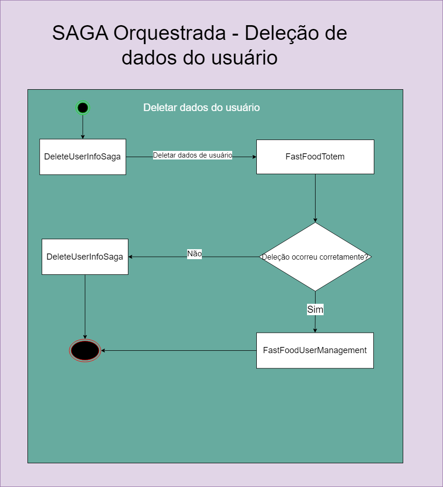

# FIAP: Pós Tech - Software Architecture

## Objetivo do repositório

Gerenciar a infraestrutura necessária de um sistema que tem como finalidade gerenciar os pedidos feitos em uma lanchonete.

## Arquitetura Geral do Projeto

Os repositórios que constam nessa arquitetura são:
- [FastFoodUserManagement](https://github.com/TechChallengeFernandoMelim/FastFoodUserManagement): serviço responsável por autenticar o cliente da lanchonete, seja via CPF ou de forma anônima.
- [FastFoodTotem](https://github.com/TechChallengeFernandoMelim/FastFoodTotem): serviço responsável por lidar com a criação do pedido por parte do cliente e com o gerencimaneto de produtos disponíveis para venda por parte da lanchonete.
- [FastFoodEmployeeManagement](https://github.com/TechChallengeFernandoMelim/FastFoodEmployeeManagement): serviço responsável por autenticar um funcionário da lanchonete utilizando e-mail e senha.
- [FastFoodPayment](https://github.com/TechChallengeFernandoMelim/FastFoodPayment): serviço responsável por criar um pagamento de acordo com o pedido solicitado pelo cliente e por atualizar o mesmo quando for pago.
- [FastFoodProduction](https://github.com/TechChallengeFernandoMelim/FastFoodProduction): serviço responsável por atender os pedidos já confirmados e pagos. Esse serviço é utilizado pelos funcionários da lanchonete.
- [FastFoodLogs](https://github.com/TechChallengeFernandoMelim/FastFoodLogs): serviço resposável por lidar com os logs das exceções disparadas pelos serviços anteriores.
- [DeleteUserInfoSaga](https://github.com/TechChallengeFernandoMelim/DeleteUserInfoSaga): saga orquestrada responsável por lidar com a exclusão dos dados dos cliente em uma ordem específica.

A arquitetura completa será explicada no vídeo disponibilizado no PDF de envio do trabalho.

## SAGA

Foram implementadas 2 tipos de SAGA, a orquestrada e a coreografada. A explicação sobre as sagas será feita no vídeo do trabalho.

### Coreografada

### Orquestrada

## Como usar

É necessário ter docker, terraform e o CLI da AWS na máquina local. O AWS CLI já deve estar configurado com o AccessKey e Secret para ter acesso à plataforma da AWS. O Docker deve estar sendo executado.

Após isso, basta apenas executar "terraform init" e "terraform apply" na pasta TechChallenge4, que é referente ao 4º trabalho.

Após a criação da infra na nuvem, é necessário atualizar uma variável de ambiente na Lambda Function chamada "FastFoodTotem". O nome da variável é "PaymentServiceUrl" e ela deve assumir a url do stage criado no Api Gateway chamado "EmployeeApiGateway".

Agora basta fazer o deploy dos projetos nas lambdas functions. Todos os projetos desse trabalho possuem uma github action em seu repositório chamada "Update Lambda". Essa action é responsável por fazer o build e push da imagem docker do projeto em um repositório no ECR(elastic Container Registry) e depois fazer o deploy da Lambda Function utilizando essa última imagem criada. Essa function está configurada para ser executada manualmente. Como o deploy em produção é algo sério, decidi deixar de forma manual para ter mais controle.

Após seguir esses passos, a infra está completa e o sistema já pode ser utilizado.

## Biblioteca postman

Disponilizei uma biblioteca do postman na raiz deste repositório chamada "FastFoodTotemPostman.postman_collection". Através dela, é possível testar a jornada de um usuário da lanchonete, desde o login até o pagamento do pedido, e a jornada de um funcionário da lanchonete, desde o login até a finalização do pedido.

A biblioteca nessecita das seguintes configurações de variáveis para funcionar que serão explicadas na prática no vídeo do trabalho:

- url_users: url do stage do api gateway de clientes
- url_employees: url do stage do api gateway de funcionários
- token_users: token de acesso do cliente quando é autenticado
- token_employees: token de acesso do funcionário quando está autenticado

Após essas configurações, a biblioteca do postman possui as seguintes etapas:

<ol start="0">
  <li>Cadastro: O cliente consegue se cadastrar com seu email, nome e CPF</li>
  <li>Login com CPF: cliente realiza login apenas com seu CPF</li>
  <li>Acesso Anônimo: cliente faz a autenticação anônima para utilizar o sistema</li>
  <li>Get Burguers: obtém os hamburguers disponíveis para venda</li>
  <li>Get Acompanhamentos: obtém os acompanhamentos disponíveis para venda</li>
  <li>Get Bebidas: obtém as bebidas disponíveis para venda</li>
  <li>Envio pedido: cliente envia pedido com os dados dos itens que selecionou e recebe o</li>
  <li>Fake checkout: endpoint que seria utilizado como webhook pelo Mercado Pago para confirmar pagamento do pedido</li>
  <li>Cadastrar Funcionario: funcionário realiza seu cadastro com email e senha</li>
  <li>Logar com funcionário: funcionário loga fornecendo email e senha</li>
  <li>Obter próximo pedido: funcionário chama endpoint que retorna o próximo pedido que está na fila para ser produzido</li>
  <li>Visualizar dados dos pedidos pendentes: funcionário visualiza todos os pedidos pendentes</li>
  <li>Mudando status do pedido para "Em preparação": atualização de status do pedido</li>
  <li>Mudando status do pedido para "Pronto": atualização de status do pedido</li>
  <li>Mudando status do pedido para "Finalizado": atualização de status do pedido</li>
</ol>

Alguns endpoints não estão expostos nessas etapas, pois não fazem parte do fluxo comum de realização de pedido, por exemplo os endpoints de gerenciamento de produtos por parte dos funcionários, mas eles existem. Com essas etapas é possível observar e testar o funcionamento de todos os serviços disponíveis.

## SonarCloud

Como ferramenta de sonar, utilizei o sonarcloud em todos os repositórios. Todos os respositórios tem uma github action chamada "SonarCloud" que está configurada para ser executada toda vez que um pull request é aberto para a branch master/main e toda vez que algum merge é feito na branch main/master. Como fiz o trabalho sozinho, não realizei muitos pull requests, mas fiz um de teste no seguinte [link](https://github.com/TechChallengeFernandoMelim/FastFoodLogs/pull/2) apenas para mostrar o funcionamento. Através dele, é possível ver a análise do sonar. 

Também configurei o SonarCloud para realizar a execução dos testes unitários e documentar a porcentagem de cobertura de código em todos os repositórios. O link para acessar o sonarcloud com as análises de todos os repositórios está [aqui](https://sonarcloud.io/organizations/techchallengefernandomelim/projects). 

## OWAS ZAP

### Listar/Exibir Cardápio

Endpoints:

- GET /v1/Product/category/1 (obter lanches(1)/acompanhamentos(2)/bebidas/(3) disponíveis): 
  - Análise antes da alteração: Não foram encontradas vulnerabilidades(demonstrado no vídeo).

### Realização do pedido e geração do pagamento

Endpoint:
- POST /v1/Order(esse endpoint faz os dois, realiza pedido e gera o QR code para pagamento): request POST não funcionou no OWASP ZAP.

### Confirmação do pagamento (WebHook)

Endpoint:
- PATCH /UpdatePayment/{{mercado-pago-pedido-id}}: request PATCH não funcionou no OWASP ZAP.
